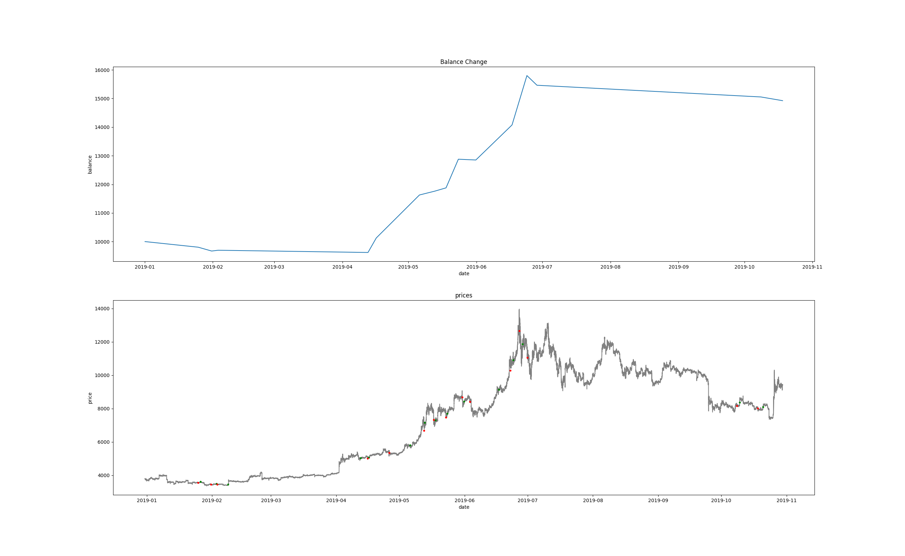

# Backtest simulation

Assuming your already have [imported](./import-candles.md) historical candles, and have set correct [routes](./routes.md) for your strategy, run:

```
jesse backtest start_date finish_date
```

Of course, `start_date` and `finish_date` must be valid date strings. A working example would be:

```
jesse backtest 2019-01-01 2019-11-01
```

And here is the output:

```
 CANDLES                |
------------------------+-------------------------
 total                  |             434880 * 1m
 trading symbols        |                 BTCUSDT
 considering symbols    |                 BTCUSDT
 trading timeframes     |                      4h
 considering timeframes |              1m, 1D, 4h
 period                 | 302 days (10.07 months)


 exchange   | symbol   | timeframe   | strategy         | DNA
------------+----------+-------------+------------------+-------
 Binance    | BTCUSDT  | 4h          | TrendFollowing04 |


Executing simulation...  [####################################]  100%
Executed backTest simulation in:  11.121385097503662


 TRADES                                |
---------------------------------------+------------------------------------
 total                                 |                                 15
 starting-finishing balance            |                  10000 => 14924.81
 fee                                   |                              59.18
 PNL (%)                               |                   4924.48 (49.24%)
 PNL% every 100 trades                 |                             328.0%
 expectancy (%)                        |                      328.3 (3.28%)
 average win/loss                      |                      779.67/187.56
 win rate                              |                                53%
 min-average-max R                     |                1.8 - 12.69 - 76.24
 longs/shorts                          |                            67%/33%
 average holding period                |  4.0 days, 3.0 hours, 18.0 minutes
 winning trades average holding period | 5.0 days, 18.0 hours, 58.0 minutes
 losing trades average holding period  |  2.0 days, 5.0 hours, 57.0 minutes
```

## Charts

Performing backtest with the `chart` flag would print out charts for the balance change in the backtest period and displaying buy/sell points.

```
jesse backtest 2019-01-01 2019-10-30 --chart
```

Now this time at the end of the statistics Jesse prints the path to the chart image:

```
Chart output saved to:
/Users/sully/Codes/jesse/jesse/storage/logs/charts/BT-2019-12-07T16:13:14.png
```

And here's the image (click to zoom or open image in a new tab to see the full size):


## TradingView

This feature is useful for those whom use [TradingView](https://www.tradingview.com) for their chart needs.
Add the `--tradingview` flag to the backtesting command:

```
jesse backtest 2019-01-01 2019-10-30 --tradingview
```

At the end of the process it will print out the path to a .txt file with a pine script as content. Then you can copy and paste that script in the [TradingView's](https://www.tradingview.com) Pine Editor as a new study script, adding it in the chart you will see entries and exits of the strategy.

Make sure to see the chart in the same timeframe as backtest simulation was executed on.
