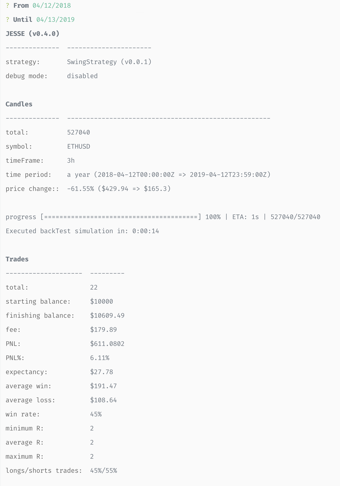

# Backtest simulation

Assuming your already have [imported](./import.md) historical candles, run:

```
npm run backtest
```

Select start and finishing dates:


Once the progress bar is reached to 100%, Jesse will print the results:


