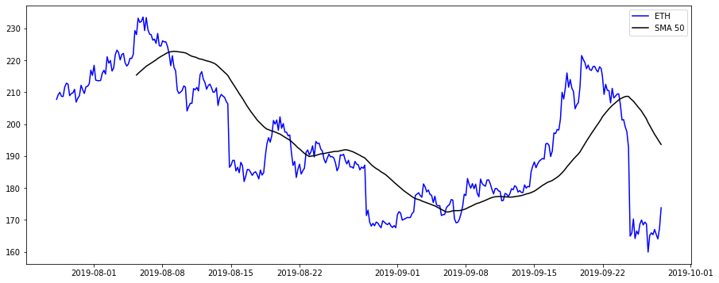

# Indicators

You can use [indicators](/docs/indicators) modules in your notebooks or custom scripts just as you did in your strategies. However, because indicators return single values by default, in case you intend to draw charts (I'm assuming that's why you're using Jupyter Notebooks in the first place) it is easier to set the `sequential=True` to get array of indicator values.

## Example
Let's import candles for `ETH-USDT` and calculate SMA with period of 50 and display them on a chart:

```py
from datetime import datetime
import matplotlib.pyplot as plt
from pandas.plotting import register_matplotlib_converters
register_matplotlib_converters()
from jesse import research
import jesse.indicators as ta


btc_candles = research.get_candles('Binance Spot', 'BTC-USDT', '30m', '2021-11-10', '2021-11-20')
btc_sma_50 = ta.sma(btc_candles, 50, sequential=True)
btc_close = btc_candles[:, 2]

# convect timestamps into a format that is supported for plotting
times = []
for c in btc_candles:
    times.append(datetime.fromtimestamp(c[0] / 1000))

plt.figure(figsize=(15, 6))
plt.plot(times, btc_close, color='blue', label='btc')
plt.plot(times, btc_sma_50, color='black', label='SMA 50')
plt.legend();
```

