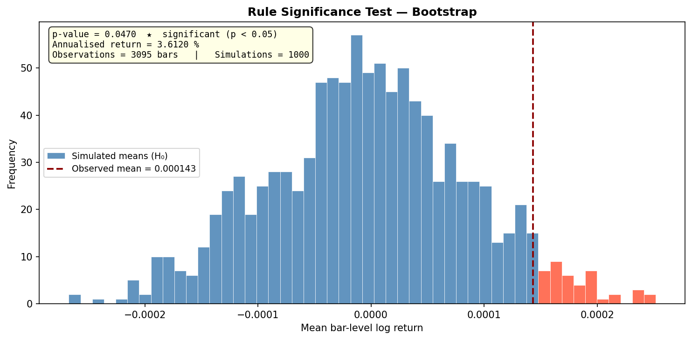
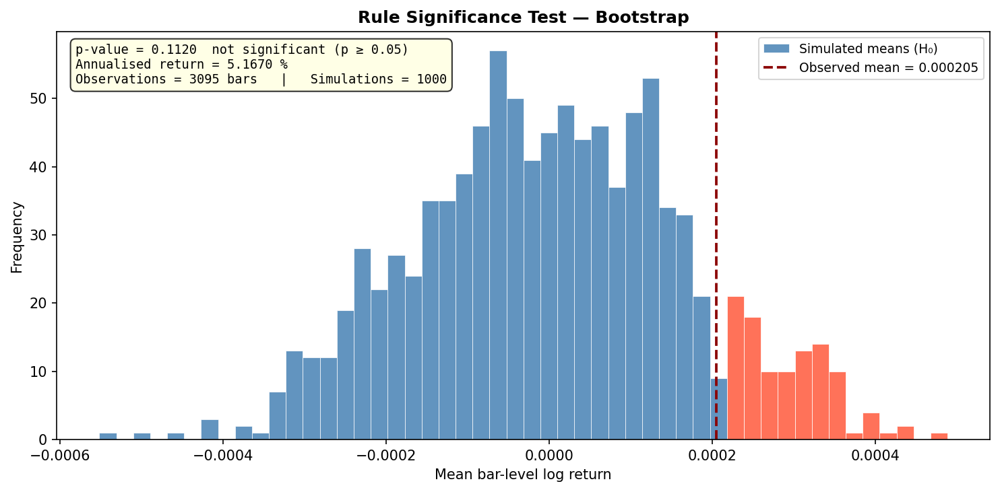

# Usage Example

This page shows two complete, runnable examples using `rule_significance_test()` and `plot_significance_test()`. The first uses a strategy with a genuine signal so the test correctly finds significance. The second uses a strategy that fires entries at random so the test correctly finds no significance.

::: tip
Make sure you have candles stored locally for the exchange, symbol, and timeframe you want to test. You can import them via the Jesse dashboard or the `import_candles()` research function.
:::

## Example 1 — Strategy with genuine edge (EMACrossover)

This strategy goes long when EMA 50 is above EMA 100 **and** ADX > 40, and short when the opposite is true. The ADX filter keeps it out of choppy, trendless markets. On BTC-USDT 4h from 2023-02-01 to 2024-07-01 the test finds a statistically significant signal.

::: tip
For the purpose of rule significance testing, the strategy does not need to be complete. Only `should_long()` and `should_short()` matter — the signal collection phase never places orders, so `go_long()` and `go_short()` can simply `pass`.
:::

**Strategy file** (`strategies/EMACrossover/__init__.py`):

```python
from jesse.strategies import Strategy
import jesse.indicators as ta


class EMACrossover(Strategy):
    def should_long(self) -> bool:
        return ta.ema(self.candles, 50) > ta.ema(self.candles, 100) and ta.adx(self.candles) > 40

    def should_short(self) -> bool:
        return ta.ema(self.candles, 50) < ta.ema(self.candles, 100) and ta.adx(self.candles) > 40

    def go_long(self):
        pass

    def go_short(self):
        pass
```

**Test script:**

```python
import logging
import os

import jesse.helpers as jh
from jesse.enums import exchanges
from jesse.research import get_candles, rule_significance_test, plot_significance_test

os.environ["RAY_DISABLE_IMPORT_WARNING"] = "1"
logging.getLogger("ray").setLevel(logging.ERROR)

# =============================================================================
# Configuration
# =============================================================================

EXCHANGE        = exchanges.BINANCE_PERPETUAL_FUTURES
SYMBOL          = "BTC-USDT"
TIMEFRAME       = "4h"
START_DATE      = "2023-02-01"
END_DATE        = "2024-07-01"
WARM_UP_CANDLES = 210

config = {
    "starting_balance":      10_000,
    "fee":                   0.0005,
    "type":                  "futures",
    "futures_leverage":      3,
    "futures_leverage_mode": "cross",
    "exchange":              EXCHANGE,
    "warm_up_candles":       WARM_UP_CANDLES,
}

routes = [
    {
        "exchange":  EXCHANGE,
        "strategy":  "EMACrossover",
        "symbol":    SYMBOL,
        "timeframe": TIMEFRAME,
    }
]

# =============================================================================
# Fetch candles
# =============================================================================

warmup_candles, trading_candles = get_candles(
    EXCHANGE,
    SYMBOL,
    TIMEFRAME,
    jh.date_to_timestamp(START_DATE),
    jh.date_to_timestamp(END_DATE),
    WARM_UP_CANDLES,
    caching=True,
    is_for_jesse=True,
)

candles = {
    jh.key(EXCHANGE, SYMBOL): {
        "exchange": EXCHANGE,
        "symbol":   SYMBOL,
        "candles":  trading_candles,
    }
}

warmup = {
    jh.key(EXCHANGE, SYMBOL): {
        "exchange": EXCHANGE,
        "symbol":   SYMBOL,
        "candles":  warmup_candles,
    }
}

# =============================================================================
# Run the test
# =============================================================================

result = rule_significance_test(
    config         = config,
    routes         = routes,
    data_routes    = [],
    candles        = candles,
    warmup_candles = warmup,
    n_simulations  = 1000,
    random_seed    = 42,
    progress_bar   = True,
)

# =============================================================================
# Print results
# =============================================================================

p = result["p_value"]
if p <= 0.001:
    label = "HIGHLY SIGNIFICANT (p ≤ 0.001) ★★★"
elif p <= 0.01:
    label = "VERY SIGNIFICANT (p ≤ 0.01) ★★"
elif p <= 0.05:
    label = "STATISTICALLY SIGNIFICANT (p ≤ 0.05) ★"
elif p <= 0.10:
    label = "POSSIBLY SIGNIFICANT (p ≤ 0.10) ~"
else:
    label = "not significant (p > 0.10)"

print(f"\n{'='*60}")
print(f"  Rule Significance Test — Bootstrap")
print(f"{'='*60}")
print(f"  Observations      : {result['n_observations']} bars")
print(f"  Simulations       : {result['n_simulations']}")
print(f"  Observed mean     : {result['observed_mean']:.8f}")
print(f"  Annualised return : {result['annualized_return'] * 100:.4f} %")
print(f"  p-value           : {p:.4f}   →  {label}")
print(f"{'='*60}\n")

plot_significance_test(result)
```

**Output:**

```
============================================================
  Rule Significance Test — Bootstrap
============================================================
  Observations      : 3095 bars
  Simulations       : 1000
  Observed mean     : 0.00014333
  Annualised return : 3.6120 %
  p-value           : 0.0470   →  STATISTICALLY SIGNIFICANT (p ≤ 0.05) ★
============================================================
```

The p-value of 0.047 means only 4.7 % of random bootstrap resamples matched or beat the rule's observed mean. The ADX filter gives the crossover a genuine edge on this period.




## Example 2 — Strategy with no edge (RandomSignal)

This strategy fires long 80 % of the time, short 5 %, and stays flat 15 % — all chosen at random with no regard for market conditions. The null hypothesis should not be rejected and the p-value should be well above 0.05.

**Strategy file** (`strategies/RandomSignal/__init__.py`):

```python
import random
from jesse.strategies import Strategy


class RandomSignal(Strategy):
    def should_long(self) -> bool:
        return random.Random(42 + self.index).random() < 0.80

    def should_short(self) -> bool:
        r = random.Random(42 + self.index).random()
        return 0.80 <= r < 0.85

    def go_long(self):
        pass

    def go_short(self):
        pass
```

The RNG is seeded from `self.index` so the same bar always produces the same signal, making results reproducible across repeated runs.

**Test script:**

```python
import logging
import os

import jesse.helpers as jh
from jesse.enums import exchanges
from jesse.research import get_candles, rule_significance_test, plot_significance_test

os.environ["RAY_DISABLE_IMPORT_WARNING"] = "1"
logging.getLogger("ray").setLevel(logging.ERROR)

# =============================================================================
# Configuration
# =============================================================================

EXCHANGE        = exchanges.BINANCE_PERPETUAL_FUTURES
SYMBOL          = "BTC-USDT"
TIMEFRAME       = "4h"
START_DATE      = "2023-02-01"
END_DATE        = "2024-07-01"
WARM_UP_CANDLES = 210

config = {
    "starting_balance":      10_000,
    "fee":                   0.0005,
    "type":                  "futures",
    "futures_leverage":      3,
    "futures_leverage_mode": "cross",
    "exchange":              EXCHANGE,
    "warm_up_candles":       WARM_UP_CANDLES,
}

routes = [
    {
        "exchange":  EXCHANGE,
        "strategy":  "RandomSignal",
        "symbol":    SYMBOL,
        "timeframe": TIMEFRAME,
    }
]

# =============================================================================
# Fetch candles
# =============================================================================

warmup_candles, trading_candles = get_candles(
    EXCHANGE,
    SYMBOL,
    TIMEFRAME,
    jh.date_to_timestamp(START_DATE),
    jh.date_to_timestamp(END_DATE),
    WARM_UP_CANDLES,
    caching=True,
    is_for_jesse=True,
)

candles = {
    jh.key(EXCHANGE, SYMBOL): {
        "exchange": EXCHANGE,
        "symbol":   SYMBOL,
        "candles":  trading_candles,
    }
}

warmup = {
    jh.key(EXCHANGE, SYMBOL): {
        "exchange": EXCHANGE,
        "symbol":   SYMBOL,
        "candles":  warmup_candles,
    }
}

# =============================================================================
# Run the test
# =============================================================================

result = rule_significance_test(
    config         = config,
    routes         = routes,
    data_routes    = [],
    candles        = candles,
    warmup_candles = warmup,
    n_simulations  = 1000,
    random_seed    = 42,
    progress_bar   = True,
)

# =============================================================================
# Print results
# =============================================================================

p = result["p_value"]
if p <= 0.001:
    label = "HIGHLY SIGNIFICANT (p ≤ 0.001) ★★★"
elif p <= 0.01:
    label = "VERY SIGNIFICANT (p ≤ 0.01) ★★"
elif p <= 0.05:
    label = "STATISTICALLY SIGNIFICANT (p ≤ 0.05) ★"
elif p <= 0.10:
    label = "POSSIBLY SIGNIFICANT (p ≤ 0.10) ~"
else:
    label = "not significant (p > 0.10)"

print(f"\n{'='*60}")
print(f"  Rule Significance Test — Bootstrap")
print(f"{'='*60}")
print(f"  Observations      : {result['n_observations']} bars")
print(f"  Simulations       : {result['n_simulations']}")
print(f"  Observed mean     : {result['observed_mean']:.8f}")
print(f"  Annualised return : {result['annualized_return'] * 100:.4f} %")
print(f"  p-value           : {p:.4f}   →  {label}")
print(f"{'='*60}\n")

plot_significance_test(result)
```

**Output:**

```
============================================================
  Rule Significance Test — Bootstrap
============================================================
  Observations      : 3095 bars
  Simulations       : 1000
  Observed mean     : 0.00020504
  Annualised return : 5.1670 %
  p-value           : 0.1120   →  not significant (p > 0.10)
============================================================
```

Despite a positive observed mean (BTC trended up during this period, so even random longs captured some drift), the p-value of 0.112 confirms there is no genuine signal — 11.2 % of random resamples matched or beat it, which is well within the range of chance.



## Parameters reference

- **config** (dict): Strategy configuration — same format as `research.backtest()`. Must include `starting_balance`, `fee`, `type`, `futures_leverage`, `futures_leverage_mode`, `exchange`, and `warm_up_candles`.
- **routes** (list): Exactly one trading route. The strategy must implement `should_long()` and/or `should_short()` to emit meaningful signals.
- **data_routes** (list): Any number of data-only routes that the strategy reads via `self.get_candles()` but does not trade on.
- **candles** (dict): Candles for the trading period, keyed by `jh.key(exchange, symbol)`.
- **warmup_candles** (dict, optional): Warm-up candles in the same key format. Pass the array returned by `get_candles(..., is_for_jesse=True)`.
- **hyperparameters** (dict, optional): Hyperparameter overrides forwarded to the strategy's `hyperparameters()` method.
- **n_simulations** (int, default=`200`): Number of bootstrap resamples. At least `1000` is recommended for a reliable p-value.
- **random_seed** (int, optional): Base random seed for reproducibility.
- **progress_bar** (bool, default=`False`): Show a `tqdm` progress bar during the simulation phase.
- **cpu_cores** (int, optional): Number of parallel Ray workers. Defaults to 80 % of available cores.

## Return value

`rule_significance_test()` returns a `dict` with the following keys:

- **observed_mean** (float): Mean bar-level log return of the rule after detrending.
- **annualized_return** (float): `observed_mean × 252` — a rough annualised estimate.
- **simulated_means** (np.ndarray): Shape `(n_simulations,)`. The full bootstrap null distribution.
- **p_value** (float): Fraction of simulated means ≥ `observed_mean`. At or below `0.10` is possibly significant; at or below `0.05` is statistically significant; at or below `0.001` is highly significant.
- **n_simulations** (int): Number of simulations completed.
- **n_observations** (int): Number of bars used after warmup and NaN removal.

See [Interpreting Results](/docs/rule-significance-testing/interpreting-results) for a full guide on reading these numbers.
