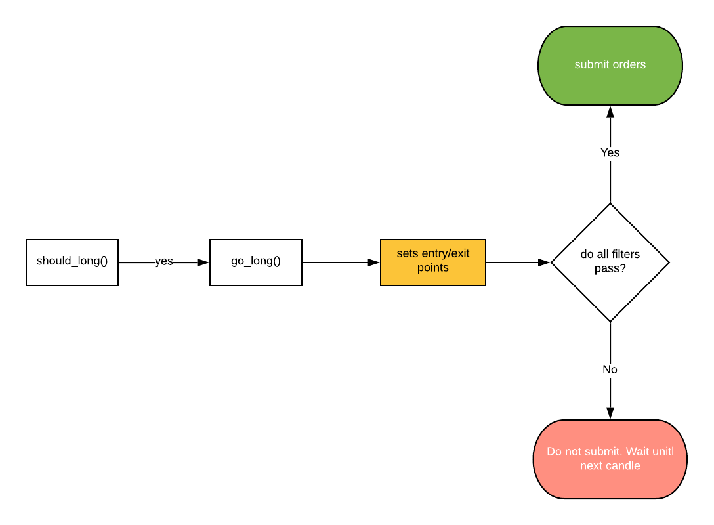

# Filters

Filter functions are used to filter out bad trades. 

## Basic syntax

First, add the `filters()` method to your strategy class which must return a list:
```py
def filters(self):
    return []
```

Then define filter methods as many as you need. They can have any name, but it is recommended to include the word `filter` in it:

```py
def filter_1(self):
    return abs(self.price - self.long_EMA) < abs(self.price - self.longer_EMA)
```

And then add the method's object to the `filters` method's list:
```py
def filters(self):
    return [
        self.filter_1
    ]
```

::: danger
Notice that you must only add the method's object to the list. Do not call the method! (no parentheses at the end of the method name)

Wrong example:
```py
def filters(self):
    return [
        self.filter_1()
    ]
```
:::

## Why filters?
There are two reasons for using them:

### 1. To keep entry rules clean
Having so many conditional statements in `should_long()`/`should_short()` is not good practice. 

You should keep your entry rules as simple as possible. You can then add filters per each special condition that you would like to avoid.

### 2. Filters have access to entry and exit points
Entry rules are defined in `should_long()` and `should_short()` functions; however entry and exit points are defined in `go_long()` and `go_short()` functions. That means if you need to evaluate a condition based on entry and exit points, you have to do it in a filter instead. 

They say a picture worths a thousand words:



For example let's write a filter that makes sure the minimum PNL for trades is bigger than 1%:

```py 
def minimum_pnl_filter(self):
    reward_per_qty = abs(self.average_take_profit - self.average_entry_price)
    pnl_percentage = (reward_per_qty / self.average_entry_price) * 100
    return pnl_percentage > 1
```

Notice that we are using `self.average_entry_price` and `self.average_take_profit` properties which were not available inside `should_long()` methods.


### 3. Easier debugging 
When a filter prevents opening a trade by not passing, it gets logged which is helpful for debugging.
