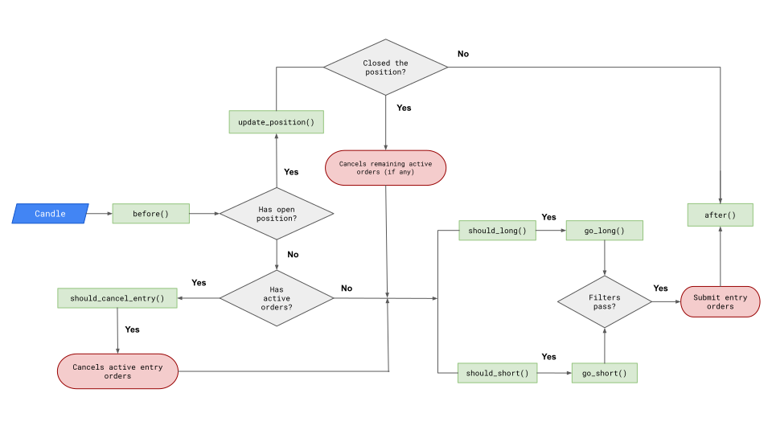

# Strategies

Jesse ships with a number of pre-built strategies. Whether they are profitable or not for your purposes, it doesn't really matter. Jesse's API for defining your custom strategies is where it shines indeed.

::: tip 🎥 Video Tutorial
In case you prefer watching a video, here's a [short screencast explaining below flowchart step by step](https://youtu.be/e0iMTbwFbs4).
:::

Jesse waits until it receives a new candle. When it does, it goes through a series of functions to make decisions. Here's a flowchart presenting the steps:

There's also the concept of [events](./events.html) which are functions you use to determine what should happen after certain events happen to your position. These could occur at any time and not necessarily at candle close time. For example, when your entry order gets executed and you open a new position, the `on_open_position` event is called.
