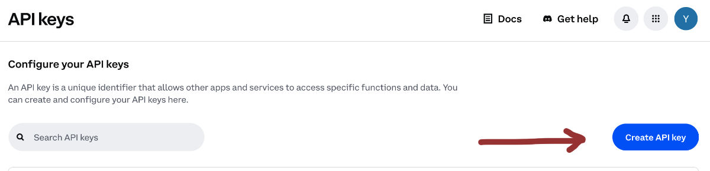
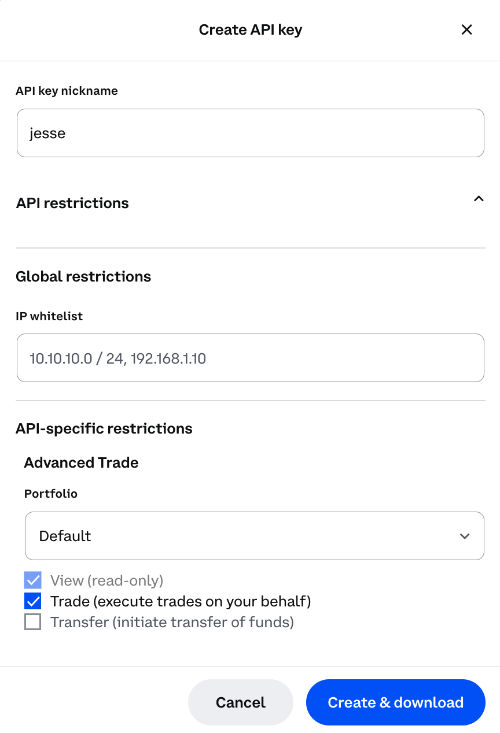
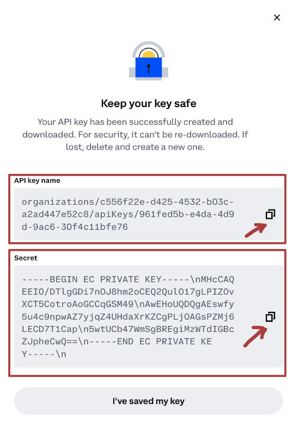

# Exchange Setup Guide

On this page, we'll go through the process of setting up an exchange for live trading.

## Apex Pro (our recommended DEX)

Please watch the following video to learn how to set up Apex Pro for live trading on Jesse:

## Coinbase 

At the moment, we support Coinbase Spot which is also known as Coinbase Advanced. To set up Coinbase for live trading, you need to create an API key. Go to [this page](https://portal.cdp.coinbase.com/access/api) to create one: 

After clicking on the "**Create API Key**" button, and entering a nickname, click on the API restrictions to open extra options:

You can optionally (highly recommended) choose to enter your server's IP address into the IP whitelist section for more security.

Most importantly, make sure to check the "**Trade**" checkbox under the advanced trade section to allow your Jesse instance to execute orders on your behalf.

Finally, you're given the API key and secret that you need to copy and paste into your Jesse incense:

## DYDX (v3)

Unfortunately, the website of DYDX doesn't offer API keys. However, there is a way to obtain them through your web browser's console.

To do this, go to the DYDX Perpetuals exchange and right-click anywhere on your web browser. Then, select "Inspect" to open the Developer Tools. From there, navigate to "Application," and then to "Local Storage" and finally, to "https://trade.dydx.exchange."

Once there, select "STARK_KEY_PAIRS" and click the drop-down next to your wallet address to retrieve the stark private key. Next, select "API_KEY_PAIRS" and click the drop-down next to your wallet address to obtain the API key, secret key, and passphrase.

