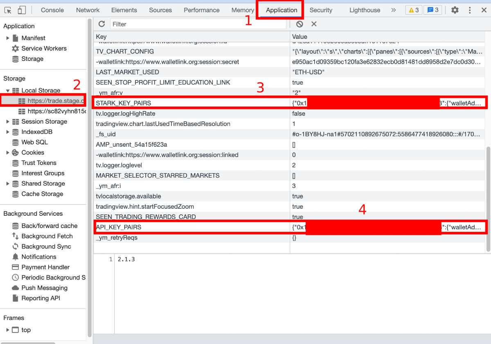

# Exchange Setup Guide

On this page, we'll go through the process of setting up an exchange for live trading.

## DYDX

Unfortunately, the website of DYDX doesn't offer API keys. However, there is a way to obtain them through your web browser's console.

To do this, go to the DYDX Perpetuals exchange and right-click anywhere on your web browser. Then, select "Inspect" to open the Developer Tools. From there, navigate to "Application," and then to "Local Storage" and finally, to "https://trade.dydx.exchange."

Once there, select "STARK_KEY_PAIRS" and click the drop-down next to your wallet address to retrieve the stark private key. Next, select "API_KEY_PAIRS" and click the drop-down next to your wallet address to obtain the API key, secret key, and passphrase.

