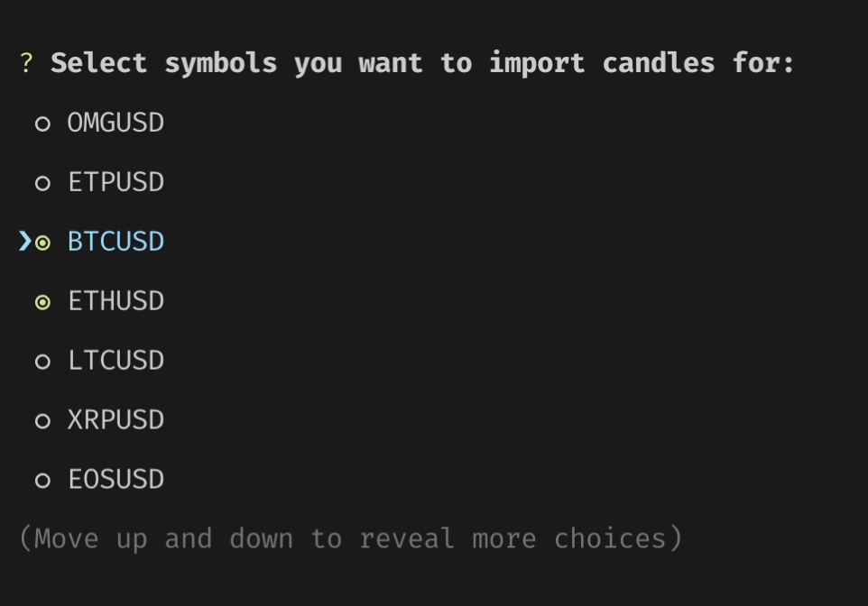
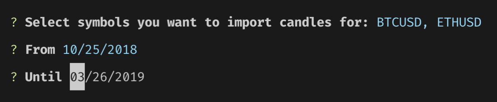
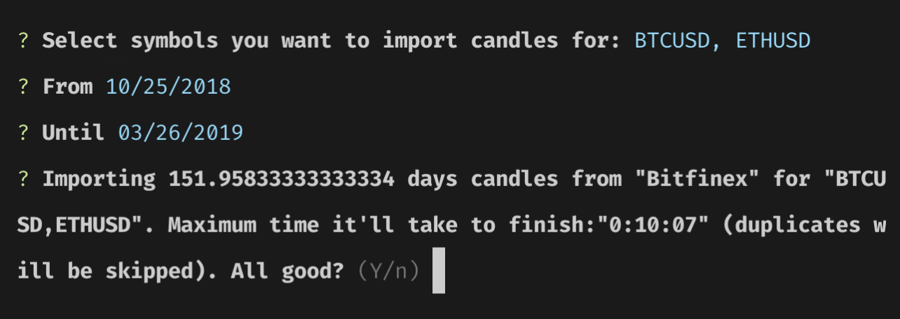
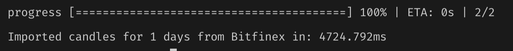

# Importing Candles 

To run backtest simulations on your trading strategies, first you need historical candles. Fetching candles with Jesse is so easy you don't really need to think about it at all. 

Assuming you have already set your desired exchange in `.env` file, run:
```
npm run import
```

Now, answer the following questions: 

1. Pick your target symbol(s) using space and when you're done, press Enter:



2. Pick the period you intend to import candles for: 



3. At this point, Jesse will inform you on how long it'll take to import candles, and ask for your confirmation to begin importing:
 
 

4. After confirming with pressing `y`, it'll begin importing, and showing the progress as it does: 



That's it!

::: tip 
You don't need to be really specific on dates. Jesse is smart enough to skip the duplicates by itself so that importing new candles in the future would be even easier.  
:::