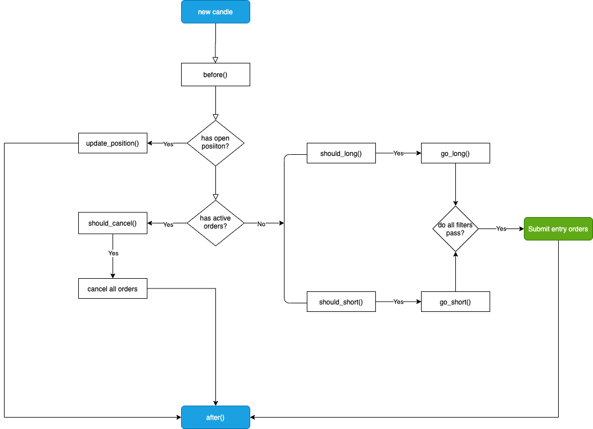

# Strategies

Jesse ships with a number of pre-built strategies. Whether they are profitable or not for your purposes, it doesn't really matter. Jesse's API for defining your custom strategies is where it shines indeed.

Jesse waits until it receives a new candle. When it does, it goes through a series of functions to make decisions. Here's a flowchart presenting the steps:

There's also the concept of [events](./events) which are functions you use to determine what should happen after certain events happen to your position.  
