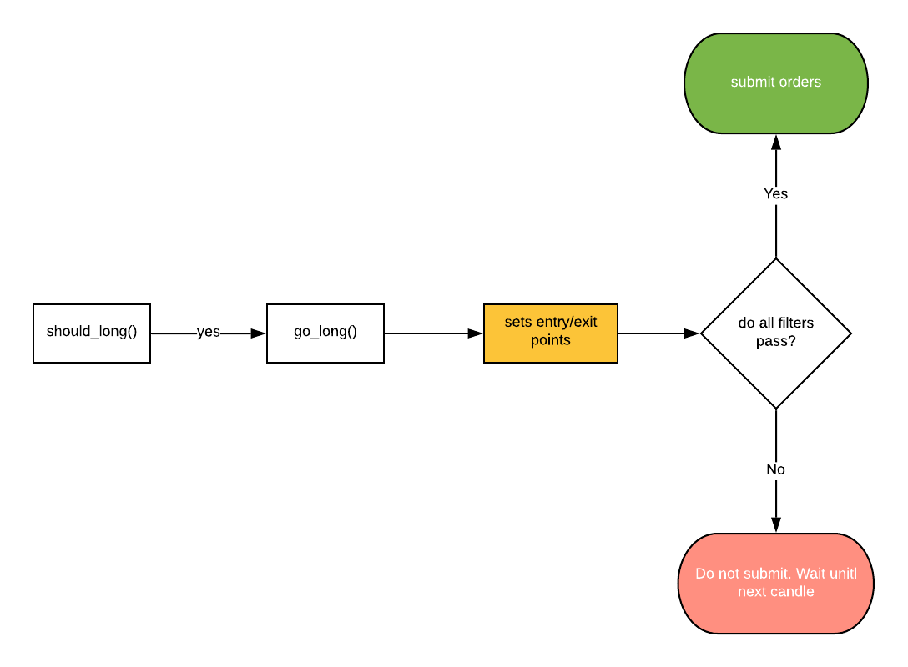

# Фильтры

Функции фильтра используются для исключения плохих сделок.

## Базовый синтаксис

Вопервых, добавьте `filters()` метод в вашему классе стратегии который возвращает список:
```py
def filters(self):
    return []
```

Дальше определите фильтровочные методы, столько, сколько требуется. Они могут называться как угодно, но рекомендуется включать `filter` в название:

```py
def filter_1(self):
    return abs(self.price - self.long_EMA) < abs(self.price - self.longer_EMA)
```

А затем добавьте объект метода к списку метода `filters`:
```py
def filters(self):
    return [
        self.filter_1
    ]
```

::: danger Опасно
Обратите внимание, что вы должны добавить только объект метода в список. Не называйте метод! (Нет скобок в конце имени метода)

Wrong example:
```py
def filters(self):
    return [
        self.filter_1()
    ]
```
:::

## Почему фильтры?
Есть две причины использования их:

### 1. Чтобы сохранить правила входа чистымы
Так как много условных выражений в `should_long()`/`should_short()` не хорошая практика. 

Вы должны сохранить правила вашего входа максимально простыми. Затем вы можете добавить фильтры на каждое особое условие, которое вы хотели бы избежать.

### 2. Фильтры имеют доступ к точкам входа и выхода
Правила входа определены в `should_long()` а также `should_short()` функциях; Однако точки входа и выхода определены в `go_long()` и `go_short()` функциях. Это означает, что если вам нужно оценить условие на основе точек входа и выхода, вы должны сделать это в фильтре. 

Лучше один раз увидеть:



Например, давайте напишем фильтр, который гарантирует, что минимальный PNL для сделок больше 1%:

```py 
def minimum_pnl_filter(self):
    reward_per_qty = abs(self.average_take_profit - self.average_entry_price)
    pnl_percentage = (reward_per_qty / self.average_entry_price) * 100
    return pnl_percentage > 1
```

Обратите внимание, что мы используем `self.average_entry_price` и `self.average_take_profit` свойства, которые не были доступны внутри `should_long()` метода.


### 3. Легкая отладка 
Когда фильтр предотвращает открытие сделки, не проходя, он записывается в лог.

На данный момент Джесси поддерживает только бэктесты, поэтому вам нужно запускать тесты с `--debug` флагом, чтобы увидеть зарегистрированное сообщение о фильтрации. Позже, когда плагин живой торговле будет реализован, это добавит разницу для живых стратегий тоже. 